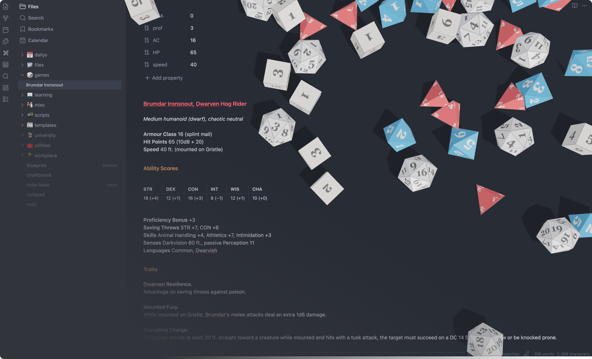

  

<h1 align="center">Obsidian Dice Roller</h1>

  Physics-based dice rolling directly inside <a href="https://obsidian.md">Obsidian</a>.

  
  

## Features

- **Real physics simulation**, dice tumble, collide, and settle naturally.
- **Advanced dice notation**, powered by [`rpg-dice-roller`](https://github.com/dice-roller/rpg-dice-roller).
- **Frontmatter variables**, use YAML values directly in rolls
- **Custom dice skins**, drop in your own GLB models and PBR textures

## Quick Start

Since this plugin isn't officially released in the Community Plugins store yet, the easiest way to install it is with [Obsidian BRAT](https://community.obsidian.md/plugins/obsidian42-brat), which lets you install plugins directly from GitHub.

After BRAT is enabled:

1. Open Settings
2. Go to BRAT
3. Click Add Beta Plugin, you'll be asked for the plugin's GitHub repository URL. (https://github.com/mcmanussliam/obsidian-diceroller)
4. Install it
5. And that's it 🎉

  Built for TTRPG players, worldbuilders, and dungeon masters.

